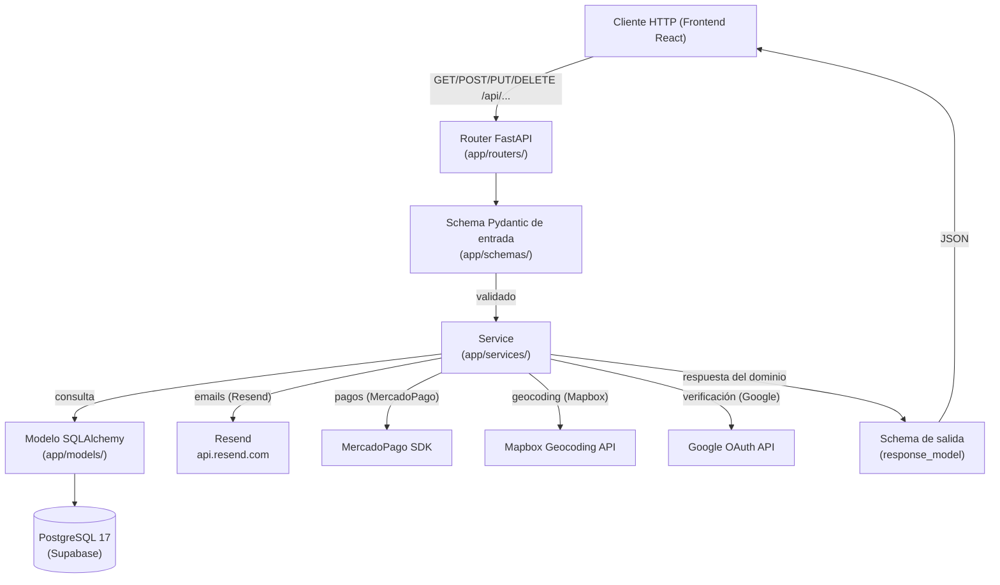
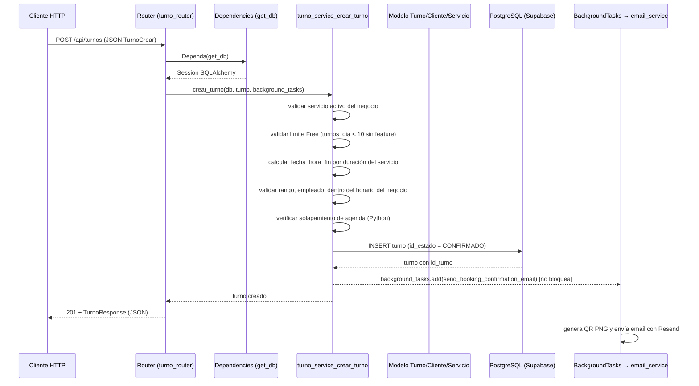

# Arquitectura — Backend TurnoGo

Documento verificado contra el código fuente. Describe la arquitectura general, las capas del sistema, las dependencias, el acceso a datos y el flujo completo de una petición HTTP.

## 1. Arquitectura general

El backend es un **monolito modular organizado en capas** dentro de un único paquete de Python (`app/`). No hay microservicios, message broker, colas ni workers separados: todo el procesamiento ocurre dentro del proceso de la aplicación servida por Uvicorn.

La separación de responsabilidades es **unidireccional**:

```
                             HTTP (JSON)
                                  │
                                  ▼
   ┌────────────────────────────────────────────────────────────┐
   │  Routers  (app/routers/)           Capa de presentación    │
   │  · Reciben la petición y parsean query/body/path params.   │
   │  · Inyectan dependencias (auth, DB session).               │
   │  · Delegan en services.                                    │
   │  · No contienen lógica de negocio (con excepciones:        │
   │    comprobaciones de propiedad "dueño/admin" en línea).    │
   └──────────────────────────┬─────────────────────────────────┘
                              ▼
   ┌────────────────────────────────────────────────────────────┐
   │  Schemas (app/schemas/)       Capa de validación (Pydantic)│
   │  · DTOs de entrada (Create/Update) y salida (Response).    │
   │  · from_attributes=True para serializar modelos ORM.       │
   │  · Validación por modelo (model_validator) en turnos.      │
   └──────────────────────────┬─────────────────────────────────┘
                              ▼
   ┌────────────────────────────────────────────────────────────┐
   │  Services (app/services/)     Capa de aplicación / negocio │
   │  · Toda la lógica de negocio del sistema.                  │
   │  · Manejan Session de SQLAlchemy directamente (no hay      │
   │    capa de repositorios).                                  │
   │  · Levantan HTTPException con códigos de estado.           │
   │  · Orquestan servicios externos (Resend, MP, Mapbox).      │
   └──────────────────────────┬─────────────────────────────────┘
                              ▼
   ┌────────────────────────────────────────────────────────────┐
   │  Models (app/models/)      Capa de persistencia (ORM)      │
   │  · Tablas y relaciones.                                    │
   │  · SQLAlchemy declarative_base (app/db/base.py).           │
   └──────────────────────────┬─────────────────────────────────┘
                              ▼
                    PostgreSQL 17 (Supabase)
```

### Diagrama Mermaid — capas y flujo de una petición



## 2. FastAPI

- La aplicación se construye en la factory `create_app()` de `app/main.py` (una única instancia `app`).
- Título `Turnogo`; se agrega `CORSMiddleware` con origen fijo:
  - `http://localhost:5173`
  - `https://www.turnogo.app`
  - `https://turnogo.app`
- Endpoints de raíz:
  - `GET /` — healthcheck.
  - `GET /db-test` — prueba de conexión a la base (`SELECT 'conexion OK'`).
- **Montaje de routers** (todos con prefijo `/api`):

```python
app.include_router(usuario_router,      prefix="/api", tags=["Usuarios"])
app.include_router(auth_router,         prefix="/api", tags=["Auth"])
app.include_router(turno_router,        prefix="/api", tags=["Turnos"])
app.include_router(empleado_router,     prefix="/api", tags=["Empleados"])
app.include_router(servicio_router,     prefix="/api", tags=["Servicios"])
app.include_router(negocio_router,      prefix="/api", tags=["Negocios"])
app.include_router(categoria_router,    prefix="/api", tags=["Categorias"])
app.include_router(cliente_router,      prefix="/api", tags=["Clientes"])
app.include_router(horarios_negocio_router, prefix="/api", tags=["Horarios"])
app.include_router(georef_router,       prefix="/api", tags=["Georef"])
app.include_router(plan_router,         prefix="/api", tags=["Planes"])
app.include_router(estadistica,         prefix="/api", tags=["Estadistica"])
app.include_router(pago_router,         prefix="/api", tags=["Pagos"])
```

- No se definen handlers globales de excepción; el manejo de errores se hace con `HTTPException(status_code, detail)` en servicios y routers.
- No hay middleware propio de autenticación global: la protección se resuelve **por dependencia** en cada endpoint.
- No se registra `start_scheduler()` (el módulo `app/core/scheduler_wsp.py` define el job pero indica en su docstring que aún no está activado).

## 3. Routers

Cada router es un `APIRouter` registrado en `main.py`. Sus responsabilidades:

- Definir rutas, métodos, `response_model` y `status_code`.
- Parsear parámetros (`Query`, `Path`, body).
- Inyectar dependencias de FastAPI: `get_db` / `get_current_user` / `get_current_negocio`.
- Validaciones de autorización **en línea** (p. ej. comprobar que el negocio pertenece al usuario autenticado en `servicio_router.py` y `negocio_router.py`).

Tabla de routers en el código:

| Archivo | Prefijo | Puntos de API |
|---|---|---|
| `routers/auth_router.py` | `/auth` | register, login, google, verify-email, verify-credentials, verify-2fa, resend-code, forgot-password, reset-password, me, test-email |
| `routers/turno_router.py` | `/turnos` | CRUD + `/por-rango` + `/{id}/estado` |
| `routers/negocio_router.py` | `/negocios` | lista, mapa, me, slug, CRUD, backfill de coordenadas, admin |
| `routers/servicio_router.py` | `/servicios` | CRUD + toggle activo (PATCH) |
| `routers/empleado_router.py` | `/empleados` | listar/obtener/crear |
| `routers/cliente_router.py` | `/clientes` | listar/obtener/get-or-create |
| `routers/horarios_negocio_router.py` | `/horarios` | crear/obtener/actualizar/eliminar por negocio |
| `routers/categoria_router.py` | `/categorias` | CRUD |
| `routers/georef_router.py` | `/georef` | provincias, localidades, test-geocoding |
| `routers/plan_router.py` | `/planes` | listar planes, funciones de un negocio |
| `routers/pago_router.py` | `/pagos` | crear-preferencia, webhook, suscripción actual, cancelar, renovación automática |
| `routers/estadistica.py` | `/statistics` | dashboard por negocio |
| `routers/usuario_router.py` | `/usuarios` | CRUD + estado |
| `routers/admin_router.py` | — | Solo código comentado (no expone endpoints funcionales) |

## 4. Schemas

Carpeta `app/schemas/`. Son modelos **Pydantic v2** usados como DTOs:

- **Entrada**: `*Create`, `*Update`, `*Request` (p. ej. `TurnoCrear`, `TurnoActualizar`, `RegisterRequest`). Incluyen validaciones con `Field(min_length=..., max_length=...)`, `EmailStr` y `model_validator(mode="after")` (p. ej. `CambiarEstadoTurno` exige `rechazado_motivo` de 5 a 500 caracteres al cancelar).
- **Salida**: `*Response` con `model_config = ConfigDict(from_attributes=True)`, lo que permite serializar instancias de los modelos ORM directamente.

Ejemplo de composición (respuesta anidada de turno, `app/schemas/appointment_schema.py`): `TurnoResponse` embebe `ClienteSimple`, `EmpleadoSimple`, `ServicioSimple` y `EstadoSimple`.

## 5. Services

Carpeta `app/services/`. Contienen la lógica de negocio y hablan con la base vía `Session`.

- **`turno_service.py`** — corazón de la agenda: validación de servicio/negocio/empleado/horario/solapamiento, límite Free de turnos por día, generación de emails de confirmación y cancelación en background. 
- **`auth_service.py`** — registro/login, 2FA por OTP, reset de contraseña, verify-email y Google OAuth.
- **`negocio_service.py`** — creación atómica de negocio completo (imágenes, servicios, empleados, horarios), slug único, geocodificación y backfill de coordenadas.
- **`usuario_service.py`** / **`empleado_service.py`** / **`servicio_service.py`** / **`cliente_service.py`** / **`categoria_service.py`** — CRUDs del dominio con límites por plan (empleados) y validaciones.
- **`horarios_negocio_service.py`** — franjas por día, hasta 2 por día, sin solapamientos y soporte de turnos que cruzan medianoche.
- **`plan_service.py`** — gating de funcionalidades por plan (`negocio_tiene_funcion`), lista de features y suscripción activa.
- **`payment_service.py`** — integración con MercadoPago, creación de preferencia, procesamiento de webhook, gestión de suscripciones.
- **`estadistica_service.py`** — `StatisticsService` que arma KPIs, resúmenes, ingresos, agenda, asistencia y rendimiento por empleado (todo comprobado contra los turnos del negocio).
- **`email_service.py`** / **`qr_service.py`** / **`mapbox_service.py`** / **`georef_service.py`** — servicios de integración (secciones 8 y 10).

**Nota:** `services/whatsapp_service.py`, `services/dashboard_service.py`, `automations/reminder_jobs.py`, `automations/daily_closure.py` y `automations/whatsapp_service.py` existen en el repositorio pero **están vacíos** (0 líneas).

## 6. Models

Carpeta `app/models/`. Modelos SQLAlchemy heredando de `Base` (`app/db/base.py` → `declarative_base()`).

Tablas modeladas y relación con el dominio:

| Modelo | Tabla | Nodos clave de relación |
|---|---|---|
| `Usuario` | `usuarios` | 1—N `Negocio` (uno solo por usuario: `usuario_id` UNIQUE) |
| `Negocio` | `negocio` | 1—N `Turno`, `Servicio`, `Empleado`, `HorarioNegocio`, `NegocioImagen`, `Suscripcion` (cascade all, delete-orphan) |
| `Turno` | `turno` | N—1 `Negocio`, `Cliente`, `Servicio`, `Empleado`, `EstadoTurno` |
| `Servicio` | `servicio` | N—1 `Negocio` |
| `Empleado` | `empleado` | N—1 `Negocio` |
| `Cliente` | `cliente` | 1—N `Turno` |
| `EstadoTurno` | `estado_turno` | catálogo de estados (1..5) |
| `HorarioNegocio` | `horarios_negocio` | N—1 `Negocio` |
| `Categoria` | `categorias` | 1—N `Negocio` |
| `NegocioImagen` | `negocio_imagen` | N—1 `Negocio` |
| `Provincia` / `Localidad` | `provincia` / `localidades` | jerarquía geográfica |
| `Plan` | `planes` | 1—N `PlanFeature`, 1—N `Suscripcion`; propiedad `feature_keys` |
| `PlanFeature` | `plan_features` | N—1 `Plan` |
| `Suscripcion` | `suscripciones` | N—1 `Negocio`, N—1 `Plan` |
| `Metodo_Pago` | `metodo_pago` | catálogo (no referenciado por el resto del código activo) |

## 7. Repositorios

**No existen** módulos de repositorio (patrón Repository). El acceso a datos se realiza directamente desde los services mediante la `Session` de SQLAlchemy (Sección 8).

## 8. Dependencies

`app/core/dependencies.py`:

- **`get_db()`** — abre una `SessionLocal` por petición y la cierra al final (patrón dependency de FastAPI, `yield`).
  - *Nota:* también existe una copia idéntica en `app/db/session.py`; los tests sobrescriben ambas versiones.
- **`get_current_user(token)`** — valida el Bearer JWT con `oauth2_scheme = OAuth2PasswordBearer(tokenUrl="/api/auth/login")`; decodifica, lee `sub`, carga el `Usuario`; levanta 401 si algo falla.
- **`get_current_negocio(current_user, db)`** — recupera el negocio del usuario autenticado; 404 si no tiene.
- **`require_feature(feature_key)`** — factory de dependencia que comprueba, mediante `plan_service.negocio_tiene_funcion`, si la suscripción activa del negocio incluye la feature; 403 si no (usado para `imagenes_personalizadas` en `negocio_service.actualizar_negocio`).

## 9. Acceso a datos

`app/db/database.py`:

- `DATABASE_URL = decouple.config('DB')` — cadena de conexión desde el entorno.
- `create_engine` con pool configurado: `pool_pre_ping=True`, `pool_recycle=300`, `pool_size=5`, `max_overflow=10`.
- `SessionLocal = sessionmaker(autocommit=False, autoflush=False, bind=engine)`.
- Al importar se intenta `SELECT 1` como prueba de conexión (fallo silencioso).

Consultas: los services usan la API legada de SQLAlchemy (`db.query(Model).filter(...)`), `func` para agregados y `joinedload`/`selectinload` para carga anticipada de relaciones.

**Restricción anti-solapamiento a nivel de base de datos** (migración `supabase/migrations/20260317194137_esquema_inicial_turnexo.sql`):

```sql
CREATE EXTENSION IF NOT EXISTS "btree_gist";
ALTER TABLE turno
  ADD CONSTRAINT ex_turno_no_solapa_por_empleado
  EXCLUDE USING gist (
    id_empleado WITH =,
    tstzrange(fecha_hora_inicio, fecha_hora_fin, '[)') WITH &&
  );
```

`turno_service` duplica esta verificación en Python y traduce el `IntegrityError` en `HTTP 409`.

## 10. Servicios externos

| Servicio | Dónde se usa | Dato verificado |
|---|---|---|
| **Resend** (`resend` SDK) | `email_service.py` | verificación de email, reset de contraseña, OTP/2FA, confirmación de turno (adjunta QR como `cid`), cancelación |
| **MercadoPago** (`mercadopago` SDK) | `payment_service.py` | `sdk.preference().create()`, `sdk.payment().get(id)`; `init_point` (sandbox si el token es `TEST-`); webhook `notification_url` |
| **Mapbox Geocoding** (`requests`) | `mapbox_service.py` | endpoint `/geocoding/v5/mapbox.places/{query}.json`, `country=AR`, `limit=1`, timeout 10 s; devuelve `(latitud, longitud)` |
| **Google OAuth** (`google-auth`) | `auth_service.py` | `google_id_token.verify_oauth2_token(id_token, request, GOOGLE_CLIENT_ID)` |
| **Resend para OTP** — envía correos con códigos numéricos de 6 dígitos | `auth_service.py` | generados con `random.randint(100000, 999999)` |

## 11. Flujo de una petición (ejemplo completo)



Puntos clave del flujo:

1. El router valida el schema y resuelve dependencias.
2. El service realiza todas las validaciones de negocio y persiste.
3. Las notificaciones se encolan en `BackgroundTasks` para no retrasar la respuesta.
4. `turno_service._lanzar_error_integridad` traduce violaciones de la constraint GiST en `409`.
5. En `cambiar_estado_turno` el router pasa `get_current_negocio`, por lo que el service verifica que el turno pertenezca al negocio del dueño antes de cambiar su estado (403 si no coincide) y, en cancelación con motivo, encola `send_cancellation_email`.