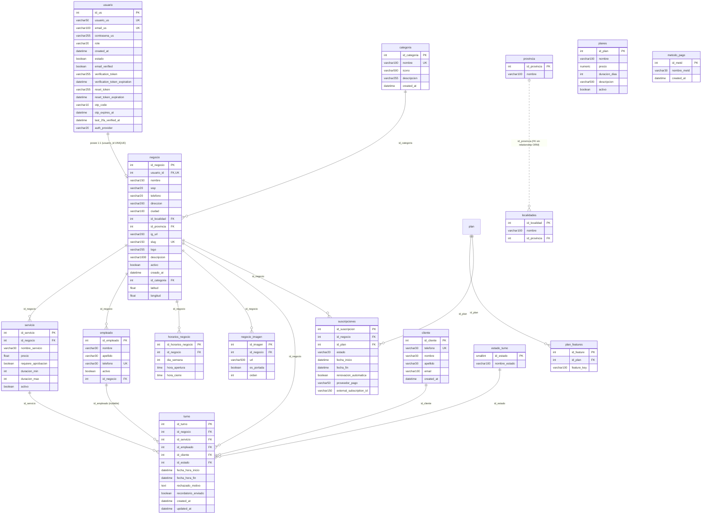

# Base de datos — Backend TurnoGo

Documentación de la capa de persistencia: motor, conexión, SQLAlchemy, Supabase, sesiones, transacciones y características relevantes. Verificado contra el código real.

---

## 1. Motor y conexión

| Aspecto | Valor |
|---|---|
| Motor | **PostgreSQL** (Supabase, versión 17) |
| Driver | `psycopg2-binary` |
| Conexión | `app/db/database.py` → `DATABASE_URL = config('DB')` (variable de entorno vía `python-decouple`, configurada en `.env`) |
| Engine (pool) | `pool_pre_ping=True`, `pool_recycle=300`, `pool_size=5`, `max_overflow=10` |
| SessionLocal | `sessionmaker(autocommit=False, autoflush=False, bind=engine)` |
| Verificación | `SELECT 1` al importar el módulo (las `OperationalError` se ignoran de forma silenciosa) |

El app se conecta a la base **directamente con la cadena Postgres** del proyecto Supabase. No usa el cliente `supabase-py`: **no** se utiliza Supabase Auth (la sesión es JWT propia + 2FA OTP) ni Supabase Storage/Realtime.

## 2. SQLAlchemy

- **Estilo de mapeo**: modelos *declarativos* (`class Base(DeclarativeBase)` en `app/db/base.py`), todos en `app/models/`. Ver [MODELOS.md](./MODELOS.md).
- **API de consultas**: estilo *legacy* `db.query(Model).filter(...)`; agregaciones con `func` (`func.count`, `func.coalesce`, …); carga ansiosa con `joinedload`/`selectinload` en los servicios.
- **Nombres de tablas**: por `__tablename__` explícito (en general en singular/`snake_case`, p. ej. `negocio`, `servicio`, `estado_turno`).
- **Inyección de sesión**: dos generadores `get_db` equivalentes, `app/core/dependencies.py` y `app/db/session.py`, ambos registrados como dependencias de FastAPI y sobreescritos en los tests.
- **Tests** (`tests/conftest.py`): SQLite **en memoria** (`sqlite://`) con `StaticPool`, pragma de FKs activada, `Base.metadata.create_all`, rollback por test vía `dependency_overrides`.

## 3. Sesiones y transacciones

El patrón general en los *services* es **una sesión = una transacción**:

```python
db = next(get_db())          # dependencia FastAPI
try:
    # ... operaciones ...
    db.commit()              # confirmación explícita
    db.refresh(obj)
except IntegrityError:
    db.rollback()            # deshacer y fallar controlado
    raise HTTPException(status_code=409, ...)
finally:
    db.close()
```

- Cada endpoint recibe su sesión vía dependencia; al terminar se cierra (generador `get_db`).
- Los errores de integridad (duplicados, solapamiento de turnos por el índice GiST) se capturan con `IntegrityError` y se traducen a `409`. Otros casos derivan en `HTTPException` con `msj` consumible por el frontend.

## 4. Supabase

- **Hosting** de PostgreSQL y contenedor de los scripts SQL (`supabase/migrations/*.sql`).
- **Esquema**: `public`. Extensión usada: `btree_gist` (indispensable para el índice de exclusión de solapamiento de turnos).
- La **libertad por migración** se declara en SQL (DDL con FKs, `ON DELETE`), mientras que los **models** replican la estructura para el ORM. Puede existir divergencia no sincronizada entre ambos (p. ej. longitud de columnas `varchar(80)` en SQL vs `String(30)` en ORM, `servicio.duracion_max` nullable en SQL vs `not null` en ORM).
- `alembic` está **presente pero apenas como convención**: `alembic/versions/` contiene migraciones de solo definición, sin `alembic/env.py` ni `alembic.ini`, por lo que **no** se genera el historial automáticamente desde los modelos; el esquema real lo define Supabase.
- **Seeds**: `app/db/seeds/` rellena catálogos de arranque: `Categoria`, `EstadoTurno`, `Plan` (+ `PlanFeature`) y `Provincia`/`Localidad` (cargadas vía `georef`).

## 5. Características relevantes

1. **Integridad de solapamiento de turnos**: índice de **exclusión GiST** por empleado en `turno`
   `(id_empleado, tstzrange(fecha_hora_inicio, fecha_hora_fin, '[)'))`
   → la DB **rechaza** turnos que se solapan; además se valida en Python antes de intentar insertar.
2. **Cascadas**: `negocio` es la raíz; borrar un negocio elimina en cascada servicio, empleado, turnos, horarios, imágenes y suscripciones. `negocio.usuario_id` es **UNIQUE** (1:1 Usuario↔Negocio).
3. **Soft deletes**: `estado`/`activo` booleanos en `usuarios`, `negocios`, `servicio`, `empleado`; los listados filtran por activo en los services. No hay borrado físico en la mayoría de flujos.
4. **Fecha/hora**: `DateTime` (con `fecha_hora_inicio` del turno) y `Time` en franjas horarias; se calcula `fecha_hora_fin` por duración del servicio.
5. **Estados de turno**: catálogo `estado_turno` (FK) + máquina de transiciones en `core/estados_turno.py` (lógica de aplicación, la DB no la valida).
6. **Unicidad globales**: `usuarios.email_us` y `usuarios.usuario_us` únicos; `cliente.telefono` único (identidad para get-or-create); `categorias.nombre` único; `negocio.slug` único (URL pública).
7. **Límites de negocio (features)**: `plan_features` define qué puede hacer un negocio (`negocio_tiene_funcion`) y el vencimiento está en `suscripciones.fecha_fin`.
8. **Pagos** (MVP en desarrollo): flujo MercadoPago con `preferencia`; si no se confirma, la suscripción empieza en `pendiente` y la preferencia se cancela por webhook/fallback.

## 6. Diagrama ER completo

Generado **exclusivamente** a partir de los modelos reales de `app/models/`. Solo se incluyen relaciones presentes (FK en migraciones SQL + `relationship` en ORM; `localidades`↔`provincia` se muestra punteada, ya que existe FK pero **no** `relationship` en el ORM).



> `metodo_pago` se incluye por completo pero **no participa** en el diagrama de relaciones: ninguna tabla referencia su PK.