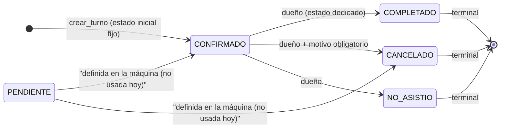

# Estados de turno — Backend TurnoGo

Máquina de estados del módulo de turnos, verificada contra `app/core/estados_turno.py`, `app/schemas/appointment_schema.py`, `app/services/turno_service.py`, `app/models/turnos.py` y su consumo en `estadistica_service.py`.

---

## 1. Catálogo del estado (`estado_turno`)

Definido como constantes en `app/core/estados_turno.py`:

| id | Constante | Nombre (`NOMBRE_ESTADO`) |
|---|---|---|
| 1 | `PENDIENTE` | `PENDIENTE` |
| 2 | `CONFIRMADO` | `CONFIRMADO` |
| 3 | `COMPLETADO` | `COMPLETADO` |
| 4 | `CANCELADO` | `CANCELADO` |
| 5 | `NO_ASISTIO` | `NO_ASISTIO` |

Representación en BD: tabla `estado_turno` (`SmallInteger` PK + `nombre_estado`). El modelo `Turno` tiene FK `id_estado` → `estado_turno.id_estado` y relación `estado`.

> `Turno.recordatorio_enviado` (Boolean) **no** es un estado: es un flag interno del scheduler (ver `RESERVAS.md` §11).

---

## 2. Máquina de estados (`TRANSICIONES_PERMITIDAS`)

Única fuente de verdad de transiciones (literal del código):

```python
TRANSICIONES_PERMITIDAS = {
    PENDIENTE:   [CONFIRMADO, CANCELADO],
    CONFIRMADO:  [COMPLETADO, CANCELADO, NO_ASISTIO],
}
```

**Consecuencias directas de esta definición:**

| Desde | Permite pasar a |
|---|---|
| PENDIENTE (1) | CONFIRMADO (2), CANCELADO (4) |
| CONFIRMADO (2) | COMPLETADO (3), CANCELADO (4), NO_ASISTIO (5) |
| COMPLETADO (3) | — (**terminal**: no figura en el dict) |
| CANCELADO (4) | — (**terminal**) |
| NO_ASISTIO (5) | — (**terminal**) |

### `validar_transicion(estado_actual, nuevo_estado)`

```python
return nuevo_estado in TRANSICIONES_PERMITIDAS.get(estado_actual, [])
```

- Los estados terminales devuelven **siempre** `False` (no tienen clave en el dict).
- Advertencias: como `CANCELADO` no figura como clave, un turno CANCELADO no puede volver a ningún estado (ni siquiera a PENDIENTE). Los terminales son irreversibles.

### Cómo se aplica la máquina (puntos de enforcement)

1. **Creación** — no usa la máquina: fija el estado inicial directo (ver §3).
2. **`actualizar_turno`** (`PUT /api/turnos/{id}`) — si el body incluye `id_estado`, lo acepta solo si `validar_transicion(estado_actual, nuevo)`. Si no → **400** `"No se puede pasar del estado X al Y"`.
3. **`cambiar_estado_turno`** (`PUT /api/turnos/{id}/estado`) — endpoint dedicado del dueño:
   - Verifica **pertenencia** del turno al negocio del token (`get_current_negocio`) → **403** `"Este turno no pertenece a tu negocio"`.
   - Aplica `validar_transicion` → **400** si es inválida.
   - Acepta `rechazado_motivo` opcional y actualiza `updated_at`.
   - Si el destino es CANCELADO y el cliente tiene email y hay motivo → encola email de cancelación.

---

## 3. Estado inicial real

`_resolver_estado_inicial(_servicio) -> int:` siempre devuelve **`CONFIRMADO` (2)**.

- Todo turno creado nace **CONFIRMADO**, sin importar los datos del servicio.
- No existe en el backend actual ningún flujo que persista `id_estado = PENDIENTE`:
  - `servicio.requiere_aprobacion` existe en modelo/schema pero **no se consulta** al crear.
  - La transición `PENDIENTE → CONFIRMADO` está **declarada** en la máquina pero **no es alcanzable hoy**, porque PENDIENTE nunca se asigna. (El fixture de tests `conftest.py` siembra el catálogo completo, incluido PENDIENTE, solo para tener los 5 estados.)
  - Por tanto no existe una "confirmación" como transición posterior a la creación: la confirmación está implicita en el estado inicial.

---

## 4. Cómo se alcanzan realmente cada estado

| Estado | Cómo se llega (flujos reales) | Observaciones |
|---|---|---|
| `PENDIENTE` (1) | **Ningún flujo backend** | Definido en catálogo y máquina; no asignado por el código actual. |
| `CONFIRMADO` (2) | **Al crear el turno** (estado inicial) | No hay flujo que pase de PENDIENTE a CONFIRMADO hoy. |
| `COMPLETADO` (3) | Desde CONFIRMADO vía `PUT .../estado` (o `PUT` con `id_estado`), solo dueño | Terminal: una vez completado no se modifica más por la máquina. |
| `CANCELADO` (4) | Desde CONFIRMADO o PENDIENTE vía cambio de estado del dueño | **Requiere `rechazado_motivo`** (ver §5). Terminal. |
| `NO_ASISTIO` (5) | Desde CONFIRMADO vía cambio de estado del dueño | Terminal. No lo automatiza ningún job. |

No hay cambios de estado automáticos (ni por fecha vencida, ni por scheduler): un turno pasado permanece en su estado hasta que el dueño lo cambie.

---

## 5. Reglas de cancelación (`CambiarEstadoTurno`)

Schema `app/schemas/appointment_schema.py:95`: `{ id_estado: int, rechazado_motivo: str | None }` con `model_validator`:

- Si `id_estado == CANCELADO` (4):
  - `rechazado_motivo` es **obligatorio** y no puede ser solo espacios (se hace `.strip()`).
  - Longitud: **mínimo 5** caracteres, **máximo 500**.
  - Se normaliza (strip) y se persiste.
- Cualquier incumplimiento → error de validación de Pydantic (422).

En el servicio (`cambiar_estado_turno`):
- `es_cancelacion = (datos.id_estado == CANCELADO) and (turno_db.id_estado != CANCELADO)`.
- El email de cancelación se encola solo si: es cancelación **y** el cliente tiene `email` **y** vino `rechazado_motivo`.
- Para otros destinos (COMPLETADO / NO_ASISTIO) el `rechazado_motivo` es opcional y sin validación de longitud.

> En `TurnoActualizar` (PUT genérico) `rechazado_motivo` es libre (sin validación de cancelación); si también se envía `id_estado`, aplica la misma máquina de transiciones.

---

## 6. Consumidores de estados (interpretación en estadísticas)

`app/services/estadistica_service.py` (relevante para entender el uso real):

- `ACTIVE_STATES = [PENDIENTE, CONFIRMADO, COMPLETADO]` — estados que cuentan como **activos** para agenda, clientes recurrentes y ocupación.
- `CANCELADO` y `NO_ASISTIO` cuentan como **cancelaciones / no-shows** (`topCancelaciones`).
- `tasaAsistencia = completados / total` donde `completados = id_estado == COMPLETADO`.
- La acumulación de ingresos/facturación solo considera turnos **COMPLETADO**.
- La métrica reporta `"reprogramados": 0` de forma **fija**: no existe un estado "reprogramado". En el backend, "reprogramar" no es un estado sino **editar** la fecha con `PUT /api/turnos/{id}` (no cambia `id_estado`).

---

## 7. Diagrama Mermaid — transiciones

Basado exclusivamente en `TRANSICIONES_PERMITIDAS` y el estado inicial real.



Notas de lectura:
- El flujo **real** transitado por la app es un subconjunto: `[*] → CONFIRMADO → {COMPLETADO|CANCELADO|NO_ASISTIO}`.
- `PENDIENTE` es un estado **definido pero no usado** (no se alcanza desde la creación ni desde ningún flujo actual).
- Todas las salidas de estados terminales están ausentes del diccionario → la máquina las trata como no-transición.