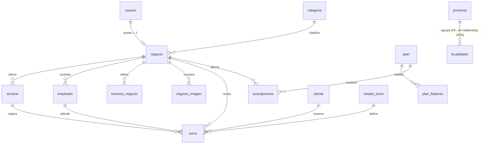

# Modelos — Backend TurnoGo

Análisis de los **16 modelos SQLAlchemy** de `app/models/`, verificado directamente contra el código. Documenta tablas, columnas, tipos, claves, índices, valores por defecto, relaciones y restricciones.

## Consideraciones previas

- Todos los modelos heredan de `Base` (`app/db/base.py` → `SQLAlchemy.declarative_base()`).
- Las restricciones **a nivel de base de datos** (CHECK, índices GiST, etc.) se declaran en las migraciones SQL de `supabase/migrations/`, no en los modelos (ver [BASE_DE_DATOS.md](./BASE_DE_DATOS.md)).
- `ondelete` se aplica a nivel de base (los FKs), mientras que `cascade="all, delete-orphan"` en la relación gestiona la cascada por objeto.

---

## 1. `Usuario` → tabla `usuarios`

Modulo: `app/models/usuario.py`

| Columna | Tipo SQLAlchemy | Null | Default | Clave / índice | Notas |
|---|---|---|---|---|---|
| `id_us` | Integer | no | — | **PK** (index) | |
| `usuario_us` | String(50) | no | — | **UNIQUE** | nombre de usuario |
| `email_us` | String(100) | no | — | **UNIQUE** + index | login por email o usuario |
| `contrasena_us` | String(255) | **sí** | — | | nullable para cuentas Google |
| `role` | String(20) | no | `"duenio"` | | valores usados: `admin`/`duenio` (`core/roles.py`) |
| `created_at` | DateTime | no | `datetime.now` | | |
| `estado` | Boolean | no | `True` | | activo/inactivo (soft) |
| `email_verified` | Boolean | no | `False` | | gate de login |
| `verification_token` | String(255) | sí | — | | token de 24 h |
| `verification_token_expiration` | DateTime | sí | — | | |
| `reset_token` | String(255) | sí | — | | |
| `reset_token_expiration` | DateTime | sí | — | | |
| `otp_code` | String(10) | sí | — | | OTP 2FA de 6 dígitos |
| `otp_expires_at` | DateTime | sí | — | | |
| `last_2fa_verified_at` | DateTime | sí | — | | mira el flujo 2FA |
| `auth_provider` | String(20) | no | `"local"` | | `local` | `google` |

**Relación:** `usuarios 1—N negocio` (`negocios`, `back_populates="usuario"`, `cascade="all, delete-orphan"`).

---

## 2. `Negocio` → tabla `negocio`

Modulo: `app/models/negocio.py`

| Columna | Tipo | Null | Default | Clave / índice | Notas |
|---|---|---|---|---|---|
| `id_negocio` | Integer | no | — | **PK** (index) | |
| `usuario_id` | Integer | no | — | **FK** `usuarios.id_us` (`ondelete=CASCADE`), **UNIQUE** | 1 negocio por usuario |
| `nombre` | String(150) | no | — | | |
| `wsp` | String(20) | no | — | | WhatsApp |
| `telefono` | String(20) | sí | — | | |
| `direccion` | String(200) | no | — | | |
| `ciudad` | String(100) | no | — | | |
| `id_localidad` | Integer | sí | — | **FK** `localidades.id_localidad` (`ondelete=SET NULL`) | |
| `id_provincia` | Integer | sí | — | **FK** `provincia.id_provincia` (`ondelete=SET NULL`) | |
| `ig_url` | String(200) | sí | — | | Instagram |
| `slug` | String(150) | no | — | **UNIQUE** (index) | usado en la URL pública |
| `logo` | String(255) | sí | — | | URL |
| `descripcion` | String(1000) | sí | — | | |
| `activo` | Boolean | no | `True` | | soft delete |
| `creado_at` | DateTime | no | `datetime.now` | | |
| `id_categoria` | Integer | no | — | **FK** `categorias.id_categoria` | |
| `latitud` / `longitud` | Float | sí | — | | geocodificación |

**Relaciones salientes:** `usuario` (← Usuario), `categoria` (← Categoria), `turnos`, `servicios`, `empleados`, `horarios`, `imagenes`, `suscripciones` (todas 1—N, `back_populates="negocio"`, `cascade="all, delete-orphan"`, `passive_deletes=True`).

---

## 3. `Turno` → tabla `turno`

Modulo: `app/models/turnos.py`

| Columna | Tipo | Null | Default | Clave / índice | Notas |
|---|---|---|---|---|---|
| `id_turno` | Integer | no | autoincrement | **PK** (index) | |
| `id_negocio` | Integer | no | — | **FK** `negocio.id_negocio` (`ondelete=CASCADE`) | |
| `id_servicio` | Integer | no | — | **FK** `servicio.id_servicio` (`ondelete=CASCADE`) | |
| `id_empleado` | Integer | **sí** | — | **FK** `empleado.id_empleado` (`ondelete=CASCADE`) | turno sin profesional |
| `id_cliente` | Integer | no | — | **FK** `cliente.id_cliente` | |
| `id_estado` | Integer | no | — | **FK** `estado_turno.id_estado` | |
| `fecha_hora_inicio` | DateTime | no | — | | |
| `fecha_hora_fin` | DateTime | sí | — | | se calcula por duración |
| `rechazado_motivo` | Text | sí | — | | obligatorio al cancelar |
| `recordatorio_enviado` | Boolean | no | `False` | | scheduler (no activo) |
| `created_at` | DateTime | no | `datetime.now` | | |
| `updated_at` | DateTime | no | `datetime.now` | `onupdate=datetime.now` | |

**Relaciones:** `negocio`, `cliente`, `empleado`, `servicio`, `estado` (→ `EstadoTurno`).

> **Restricción relevante en la base** (SQL): índice de exclusión **GiST** `ex_turno_no_solapa_por_empleado` sobre `(id_empleado, tstzrange(fecha_hora_inicio, fecha_hora_fin, '[)'))` impide turnos solapados por empleado (ver BASE_DE_DATOS.md). `turno_service` la duplica en Python y traduce el `IntegrityError` en 409.

---

## 4. `Servicio` → tabla `servicio`

Modulo: `app/models/servicio.py`

| Columna | Tipo | Null | Default | Clave / índice | Notas |
|---|---|---|---|---|---|
| `id_servicio` | Integer | no | — | **PK** (index) | |
| `id_negocio` | Integer | no | — | **FK** `negocio.id_negocio` (`ondelete=CASCADE`) | |
| `nombre_servicio` | String(30) | no | — | | |
| `precio` | Float | no | — | | |
| `requiere_aprobacion` | Boolean | sí | — | index | campo presente; en el código el estado inicial del turno es siempre `CONFIRMADO` |
| `duracion_min` | Integer | no | — | | |
| `duracion_max` | Integer | no | — | | |
| `activo` | Boolean | no | — | | soft delete |

**Relaciones:** `negocio` (←), `turnos` (`passive_deletes=True`).

> Diferencias con el SQL inicial: en la migración `servicio.duracion_max` es nullable y existe el CHECK `duracion_max >= duracion_min`; en el ORM es `not null`.

---

## 5. `Empleado` → tabla `empleado`

Modulo: `app/models/empleado.py`

| Columna | Tipo | Null | Default | Clave / índice | Notas |
|---|---|---|---|---|---|
| `id_empleado` | Integer | no | — | **PK** (index) | |
| `nombre` | String(30) | no | — | | |
| `apellido` | String(30) | no | — | | |
| `telefono` | String(30) | **sí** | — | **UNIQUE** | |
| `activo` | Boolean | no | — | | sin default en el ORM |
| `id_negocio` | Integer | no | — | **FK** `negocio.id_negocio` (`ondelete=CASCADE`) | |

**Relaciones:** `negocio` (←), `turnos` (`passive_deletes=True`).

---

## 6. `Cliente` → tabla `cliente`

Modulo: `app/models/cliente.py`

| Columna | Tipo | Null | Default | Clave / índice | Notas |
|---|---|---|---|---|---|
| `id_cliente` | Integer | no | autoincrement | **PK** (index) | |
| `telefono` | String(30) | no | — | **UNIQUE** | identidad del cliente |
| `nombre` | String(30) | no | — | | |
| `apellido` | String(30) | no | — | | |
| `email` | String(100) | **sí** | — | | usado para notificaciones |
| `created_at` | DateTime | no | `datetime.now` | | |

**Relación:** `turnos` 1—N (→ `Turno`).

> `Servicio`, `Empleado`, `Cliente` usan `String(30)` en el ORM aunque la migración SQL declare `varchar(80)`. El ORM define longitud 30.

---

## 7. `EstadoTurno` → tabla `estado_turno`

Modulo: `app/models/estado_turno.py`

| Columna | Tipo | Null | Default | Clave | Notas |
|---|---|---|---|---|---|
| `id_estado` | SmallInteger | no | — | **PK** | 1..5 |
| `nombre_estado` | String(100) | no | — | | |

**Sin relaciones** declaradas (la relación la define `Turno.estado`).

**Estados (catálogo, `core/estados_turno.py`):**

| id | nombre | Transiciones permitidas |
|---|---|---|
| 1 | PENDIENTE | → 2 (CONFIRMADO), → 4 (CANCELADO) |
| 2 | CONFIRMADO | → 3 (COMPLETADO), → 4 (CANCELADO), → 5 (NO_ASISTIO) |
| 3 | COMPLETADO | — (terminal) |
| 4 | CANCELADO | — (terminal, exige `rechazado_motivo`) |
| 5 | NO_ASISTIO | — (terminal) |

> La máquina de transiciones es **lógica de aplicación** (`validar_transicion`), no una restricción de la base de datos. Además, `turno_service._resolver_estado_inicial` siempre crea turnos en `CONFIRMADO` (2).

---

## 8. `HorarioNegocio` → tabla `horarios_negocio`

Modulo: `app/models/horarios_negocio.py`

| Columna | Tipo | Null | Default | Clave / índice | Notas |
|---|---|---|---|---|---|
| `id_horarios_negocio` | Integer | no | — | **PK** (index) | |
| `id_negocio` | Integer | no | — | **FK** `negocio.id_negocio` (`ondelete=CASCADE`) | |
| `dia_semana` | Integer | no | — | | 0..6 (weekday) |
| `hora_apertura` | Time | no | — | | |
| `hora_cierre` | Time | no | — | | soporta franjas que cruzan medianoche |

**Relación:** `negocio` (←).

> Reglas de franjas (máx. 2 por día, sin solapamientos) en `horarios_negocio_service.py` (lógica de aplicación).

---

## 9. `Categoria` → tabla `categorias`

Modulo: `app/models/categoria.py`

| Columna | Tipo | Null | Default | Clave / índice | Notas |
|---|---|---|---|---|---|
| `id_categoria` | Integer | no | — | **PK** (index) | |
| `nombre` | String(100) | no | — | **UNIQUE** | |
| `icono` | String(500) | sí | — | | URL de imagen validada |
| `descripcion` | String(255) | sí | — | | |
| `created_at` | DateTime | no | `datetime.datetime.now` | | |

**Relación:** `negocios` 1—N (→ `Negocio`).

---

## 10. `NegocioImagen` → tabla `negocio_imagen`

Modulo: `app/models/negocio_imagen.py`

| Columna | Tipo | Null | Default | Clave / índice | Notas |
|---|---|---|---|---|---|
| `id_imagen` | Integer | no | — | **PK** (index) | |
| `id_negocio` | Integer | no | — | **FK** `negocio.id_negocio` (`ondelete=CASCADE`) + index | |
| `url` | String(500) | no | — | | |
| `es_portada` | Boolean | no | `False` | | la primera imagen se crea como portada |
| `orden` | Integer | no | `0` | | |

**Relación:** `negocio` (←).

---

## 11. `Provincia` → tabla `provincia`

Modulo: `app/models/provincia.py`

| Columna | Tipo | Null | Default | Clave / índice |
|---|---|---|---|---|
| `id_provincia` | Integer | no | — | **PK** (index) |
| `nombre` | String(100) | no | — | |

**Sin relaciones** declaradas en el ORM.

## 12. `Localidad` → tabla `localidades`

Modulo: `app/models/localidad.py`

| Columna | Tipo | Null | Default | Clave / índice | Notas |
|---|---|---|---|---|---|
| `id_localidad` | Integer | no | — | **PK** (index) | |
| `nombre` | String(100) | no | — | | |
| `id_provincia` | Integer | sí | — | **FK** `provincia.id_provincia` (sin `ondelete`) | |

**Sin `relationship()` en el ORM:** la jerarquía `provincia 1—N localidad` existe por **foreign key**, pero no es navegable vía ORM (los listados de `georef_service` se hacen con `db.query` + filtro por `id_provincia`).

---

## 13. `Plan` → tabla `planes`

Modulo: `app/models/plan.py`

| Columna | Tipo | Null | Default | Clave / índice | Notas |
|---|---|---|---|---|---|
| `id_plan` | Integer | no | — | **PK** (index) | |
| `nombre` | String(100) | no | — | | |
| `precio` | Numeric | no | — | | ARS |
| `duracion_dias` | Integer | no | — | | |
| `descripcion` | String(500) | sí | — | | |
| `activo` | Boolean | no | `True` | | |

**Propiedad (no columna):** `feature_keys` → `[pf.feature_key for pf in self.funciones]`.

**Relaciones:** `funciones` 1—N `PlanFeature` (`back_populates="plan"`, `cascade="all, delete-orphan"`), `suscripciones` 1—N `Suscripcion`.

**Planes sembrados** (`app/db/seeds/seed_planes.py`): Free (0 ARS, 0 días, sin features) · Básico (4999, 30 días, `mapa_ubicacion`) · VIP (9999, 30 días, `mapa_ubicacion`, `imagenes_personalizadas`, `soporte_prioritario`).

## 14. `PlanFeature` → tabla `plan_features`

Modulo: `app/models/plan_feature.py`

| Columna | Tipo | Null | Default | Clave / índice |
|---|---|---|---|---|
| `id_feature` | Integer | no | — | **PK** (index) |
| `id_plan` | Integer | no | — | **FK** `planes.id_plan` |
| `feature_key` | String(100) | no | — | |

**Relación:** `plan` (← `Plan`). `feature_key` reales usadas en el código: `mapa_ubicacion`, `imagenes_personalizadas`, `soporte_prioritario`, `turnos_ilimitados`, `empleados_ilimitados`, `recordatorio_email`, `recordatorio_whatsapp`.

## 15. `Suscripcion` → tabla `suscripciones`

Modulo: `app/models/suscripcion.py`

| Columna | Tipo | Null | Default | Clave / índice | Notas |
|---|---|---|---|---|---|
| `id_suscripcion` | Integer | no | — | **PK** (index) | |
| `id_negocio` | Integer | no | — | **FK** `negocio.id_negocio` (`ondelete=CASCADE`) | |
| `id_plan` | Integer | no | — | **FK** `planes.id_plan` | |
| `estado` | String(20) | no | `"activa"` | | valores en el código: `activa`, `pendiente`, `cancelada` |
| `fecha_inicio` | DateTime | no | `datetime.now` | | |
| `fecha_fin` | DateTime | no | — | | vencimiento para `negocio_tiene_funcion` |
| `renovacion_automatica` | Boolean | no | `True` | | |
| `proveedor_pago` | String(50) | sí | — | | `mercadopago` |
| `external_subscription_id` | String(150) | sí | — | | id de preferencia de MercadoPago |

**Relaciones:** `negocio` (←), `plan` (← `Plan`).

> `external_subscription_id` apunta a un recurso **externo** de MercadoPago: no es foreign key de ninguna tabla local.

## 16. `Metodo_Pago` → tabla `metodo_pago`

Modulo: `app/models/metodo_pago.py`

| Columna | Tipo | Null | Default | Clave / índice |
|---|---|---|---|---|
| `id_metd` | Integer | no | — | **PK** (index) |
| `nombre_metd` | String(30) | no | — | |
| `created_at` | DateTime | no | `datetime.now` | `onupdate=datetime.now` |

**Sin relaciones:** es una tabla **huérfana** en el ORM (ningún modelo referencia `metodo_pago`). Los pagos se manejan con `Suscripcion.proveedor_pago`, no con esta tabla.

---

## Relaciones entre entidades (resumen)

| Relación | Cardinalidad | Vía | Nota |
|---|---|---|---|
| Usuario → Negocio | 1 — 1 | FK `negocio.usuario_id` **UNIQUE** | un usuario con un único negocio |
| Categoria → Negocio | 1 — N | FK `negocio.id_categoria` | |
| Negocio → Servicio | 1 — N | FK `servicio.id_negocio` | |
| Negocio → Empleado | 1 — N | FK `empleado.id_negocio` | |
| Negocio → HorarioNegocio | 1 — N | FK `horarios_negocio.id_negocio` | |
| Negocio → NegocioImagen | 1 — N | FK `negocio_imagen.id_negocio` | |
| Negocio → Turno | 1 — N | FK `turno.id_negocio` | |
| Negocio → Suscripcion | 1 — N | FK `suscripciones.id_negocio` | |
| Cliente → Turno | 1 — N | FK `turno.id_cliente` | |
| Servicio → Turno | 1 — N | FK `turno.id_servicio` | |
| Empleado → Turno | 1 — N | FK `turno.id_empleado` (nullable) | |
| EstadoTurno → Turno | 1 — N | FK `turno.id_estado` | |
| Provincia → Localidad | 1 — N | FK `localidades.id_provincia` (sin `relationship` en ORM) | navegación solo por query |
| Plan → PlanFeature | 1 — N | FK `plan_features.id_plan` | |
| Plan → Suscripcion | 1 — N | FK `suscripciones.id_plan` | |

**Relaciones por lógica de aplicación (sin FK local):**
- `Cliente` se identifica por `telefono` **UNIQUE** mediante `cliente_service.obtener_o_crear_cliente` (get-or-create). No hay FK, es un índice único + lógica.
- `Suscripcion.external_subscription_id` vincula con la preferencia de **MercadoPago** (sistema externo).
- Las **transiciones de estado** del turno (`estados_turno.py`) y las **features por plan** (`plan_service.negocio_tiene_funcion`) son reglas de aplicación sobre los catálogos/estados, no constraint de base.

## Diagrama de entidades (resumen)

> El diagrama ER completo con columnas se encuentra en [BASE_DE_DATOS.md](./BASE_DE_DATOS.md).