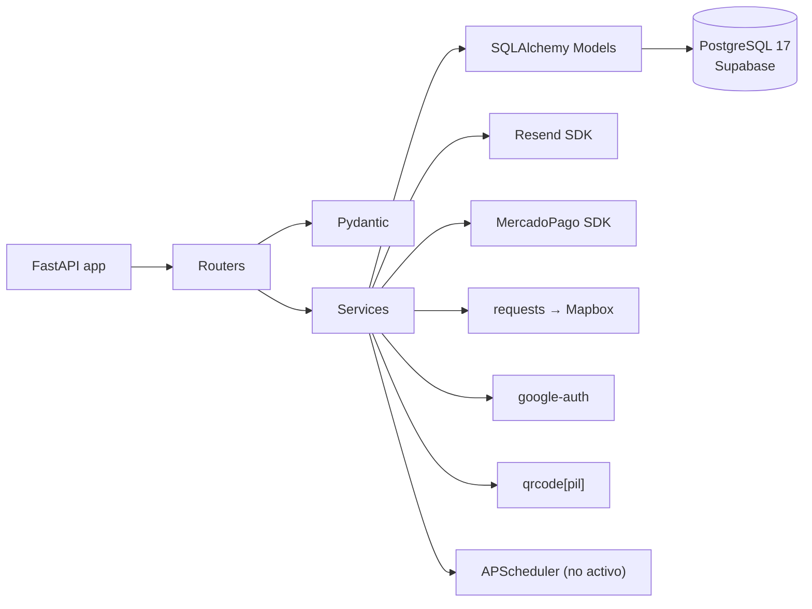

# Tecnologías — Backend TurnoGo

Lista de tecnologías y librerías realmente utilizadas, verificadas contra `requirements.txt` y el código fuente (`app/`).

## Stack principal

| Categoría | Tecnología | Verificación en el código |
|---|---|---|
| Lenguaje | **Python 3** (entorno de tests compilado con CPython 3.14) | `.pytest_cache`, `venv/` |
| Framework web | **FastAPI** (`fastapi>=0.135.3`) | `app/main.py`, routers |
| Servidor ASGI | **Uvicorn** (`uvicorn>=0.44.0`) | dependencia en `requirements.txt` |
| Validación | **Pydantic v2** (`pydantic>=2.13.0`) | `ConfigDict(from_attributes=True)`, `model_validator`, `EmailStr` |
| ORM | **SQLAlchemy 2.x** (`SQLAlchemy>=2.0.49`) | `engine`, `SessionLocal`, `db.query(...)`, relaciones |
| Base de datos | **PostgreSQL 17** (Supabase) | `supabase/config.toml` (`major_version = 17`), `psycopg2-binary` |
| Driver PostgreSQL | **psycopg2-binary** (`>=2.9.11`) | `requirements.txt` |
| Migraciones | **Alembic** | `alembic/versions/*.py` (hay `revision`/`upgrade`/`downgrade`) |

## Autenticación y seguridad

| Librería | Versión | Uso |
|---|---|---|
| `python-jose` | `>=3.5.0` | JWT: `jwt.encode`/`jwt.decode` (HS256) en `core/security.py` y `core/dependencies.py` |
| `passlib` + `bcrypt` | `>=1.7.4` / `>=4.0.1,<5.0.0` | Hash y verificación de contraseñas |
| `PyJWT` | `>=2.13.0` | Formato JWT    |
| `google-auth` | `>=2.29.0` | Verificación de `id_token` de Google (`verify_oauth2_token`) |
| `email-validator` | `>=2.3.0` | Soporte de `EmailStr` de Pydantic |
| `cryptography` | `>=46.0.7` | Soporte de bajo nivel (OAuth/JWK) |

## Integraciones externas

| Librería | Versión | Servicio | Uso |
|---|---|---|---|
| `resend` | `>=2.30.1` | Resend (emails) | `email_service.py` (envíos HTML con adjuntos QR) |
| `mercadopago` | `==3.3.0` | MercadoPago | `payment_service.py` (`SDK.preference/create`, `SDK.payment/get`) |
| `requests` | `>=2.34.1` | Mapbox / APIs HTTP | `mapbox_service.py`, `georef_service.py` |
| `qrcode` + `pillow` | `qrcode[pil]>=8.0` | Generación de QR | `qr_service.py` (`qrcode.make`, PNG bytes) |
| `apscheduler` | via `scheduler_wsp` | Scheduler de recordatorios | `core/scheduler_wsp.py` (`BackgroundScheduler`, job horario) |

> Aclaración verificable: **APScheduler no aparece en `requirements.txt`** pero sí se importa dentro de `start_scheduler()`. El scheduler no se arranca actualmente en `main.py`.

## Dependencias transitivas destacadas (presentes en `requirements.txt`)

- Concurrencia/red: `aiohttp`, `aiohttp-retry`, `anyio`, `httptools`, `watchfiles`, `websockets`, `yarl`.
- Criptografía: `bcrypt`, `cffi`, `ecdsa`, `pyasn1`, `rsa`, `pycparser`.
- Misc: `python-decouple` (`>=3.8`, lectura de `.env`), `python-dotenv`, `click`, `PyYAML`, `greenlet`, `typing-extensions`.

Dependencias con versión fija: `mercadopago==3.3.0`.

## Dependencias de desarrollo

- `pytest` (suite en `tests/` con `@pytest.fixture`, `TestClient`).
- `pylint>=4.0.6` (estático, listado como dev).

## Entorno de pruebas (verificado en `tests/conftest.py`)

- **SQLite en memoria**: `sqlite://` con `StaticPool` y `PRAGMA foreign_keys=ON`.
- **FastAPI TestClient** con override de `get_db` (tanto de `app.core.dependencies` como de `app.db.session`).

## Configuración del entorno

Variables leídas con `python-decouple` en `app/core/config.py`:

| Variable | Valor por defecto |
|---|---|
| `SECRET_KEY` | `change-this-secret-in-production` |
| `ALGORITHM` | fijo `HS256` |
| `ACCESS_TOKEN_EXPIRE_MINUTES` | `60` |
| `TWO_FACTOR_TOKEN_EXPIRE_HOURS` | `9` |
| `RESEND_API_KEY` | — (obligatoria) |
| `FRONTEND_URL` | `https://www.turnogo.app` |
| `BACKEND_URL` | — |
| `MAPBOX_ACCESS_TOKEN` | — |
| `MERCADOPAGO_ACCESS_TOKEN` | — |
| `GOOGLE_CLIENT_ID` / `GOOGLE_CLIENT_SECRET` | — |
| `DB` | cadena de conexión PostgreSQL (leída en `app/db/database.py`) |

## Diagrama de dependencias (alto nivel)

## Notas de soporte (facilitan la instalación fuera de Windows)

- `requirements.txt` usa rangos abiertos (`>=`) salvo `mercadopago` (`==3.3.0`); el `CHANGELOG.md` indica que se relajaron de `==` a `>=` y se eliminó `uvloop` por incompatibilidad con Windows.